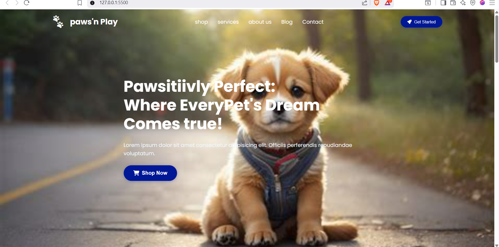

# Paws'n Play - Responsive Pet Store Landing Page

This project is a fully responsive landing page for a fictional pet store, "Paws'n Play." It was built from scratch using only **HTML5** and **CSS3**, with a focus on modern, clean design and advanced CSS techniques.

The primary goal was to create a visually appealing and functional user interface that showcases a deep understanding of responsive design, CSS Flexbox, and advanced selectors without relying on any CSS frameworks or JavaScript.

---

## ✨ Key Features

*   **Fully Responsive Design:** The layout seamlessly adapts to all screen sizes.
*   **Modern CSS Layouts:** Built entirely with **Flexbox**.
*   **Advanced CSS Selectors:** Uses pseudo-elements (`::before`, `::after`) and pseudo-classes (`:hover`) for interactive UI.
*   **Semantic HTML:** Written with clean, semantic HTML5.

---

## 🛠️ Technologies & Techniques Used

*   **HTML5**
*   **CSS3** (Flexbox, Media Queries, CSS Variables)
